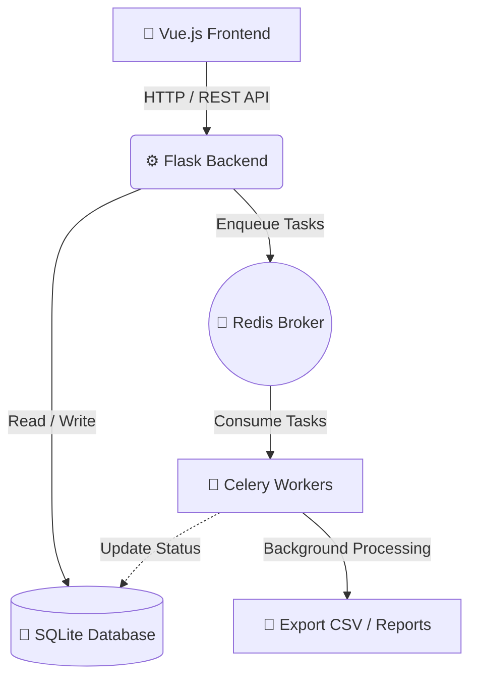
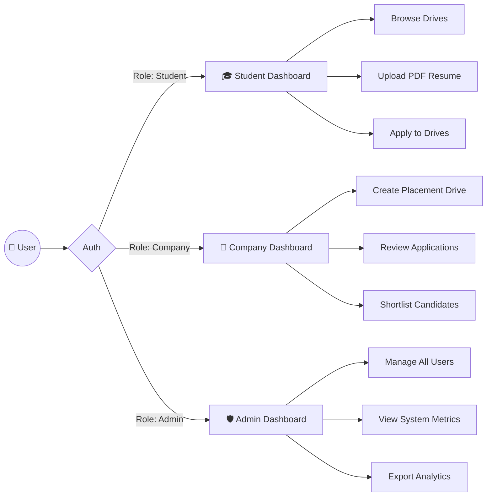

# Placement Portal Application V2

A comprehensive, full-stack web application built to streamline the college placement process. This platform connects students, recruiting companies, and college administrators through dedicated role-based dashboards, facilitating seamless drive creation, application tracking, and data management.

## 🚀 Key Features

*   **Role-Based Access Control (RBAC):**
    *   **Student Dashboard:** Browse active placement drives, upload/manage resumes (PDF), and track application status.
    *   **Company Dashboard:** Create and manage placement drives, review student applications, and shortlist candidates.
    *   **Admin Dashboard:** Centralized oversight of all users, drives, and system metrics.
*   **Asynchronous Task Processing:** Utilizes Celery for handling background tasks (e.g., automated email notifications, batch processing) without blocking the main application thread.
*   **Data Export & Reporting:** Easily export applicant lists and application histories to CSV format for external analysis.
*   **Resume Management:** Secure storage and retrieval of student resumes in PDF format.

## 📊 System Architecture & Workflows

### System Architecture
The application uses a decoupled architecture where the Vue.js frontend communicates with the Flask backend via REST APIs. Background tasks are offloaded to Celery workers using Redis as a message broker.



### User Role Workflow (RBAC)
The platform routes users to specific dashboards based on their authentication role, granting them access to distinct features.



## 🛠️ Tech Stack

### Backend
*   **Framework:** Python / Flask
*   **Database:** SQLite (managed via SQLAlchemy)
*   **Task Queue:** Celery (with scheduling capabilities via `celerybeat`)
*   **API Architecture:** RESTful endpoints for frontend consumption

### Frontend
*   **Framework:** Vue.js (Vue 3)
*   **Build Tool:** Vite
*   **Routing:** Vue Router (`/router/index.js`)
*   **Styling:** Custom CSS/Frameworks (Integrated within Vue components)

## 📂 Project Structure

```text
PlacementPortalApplication/
├── app.py                      # Main Flask application entry point
├── models.py                   # Database models and schema definitions
├── tasks.py                    # Celery background tasks
├── requirements.txt            # Python dependencies
├── instance/
│   └── placement.db            # SQLite database file
├── static/
│   ├── exports/                # Generated CSV exports (applicants, history)
│   └── resumes/                # Uploaded student resumes (PDF)
└── frontend/                   # Vue.js frontend directory
    ├── index.html              # Vue app entry HTML
    ├── package.json            # Node.js dependencies
    ├── vite.config.js          # Vite configuration
    └── src/
        ├── App.vue             # Root Vue component
        ├── main.js             # Vue app initialization
        ├── router/             # Vue Router configuration
        └── views/              # Page components
            ├── AdminDashboardView.vue
            ├── CompanyDashboardView.vue
            ├── LoginView.vue
            └── StudentDashboardView.vue
```

## ⚙️ Installation & Setup

### Prerequisites
*   Python 3.10+
*   Node.js & npm
*   Redis (for Celery message brokering)

### Backend Setup
1. Navigate to the root directory.
2. Create and activate a virtual environment:
   ```bash
   python -m venv venv
   source venv/bin/activate  # On Windows: venv\Scripts ctivate
   ```
3. Install Python dependencies:
   ```bash
   pip install -r requirements.txt
   ```
4. Start the Flask development server:
   ```bash
   flask run
   ```
5. In a separate terminal, start the Celery worker:
   ```bash
   celery -A app.celery worker --loglevel=info
   ```

### Frontend Setup
1. Navigate to the frontend directory:
   ```bash
   cd frontend
   ```
2. Install Node dependencies:
   ```bash
   npm install
   ```
3. Start the Vite development server:
   ```bash
   npm run dev
   ```

## 👨‍💻 Author
**Prakhar Maheshwari**
